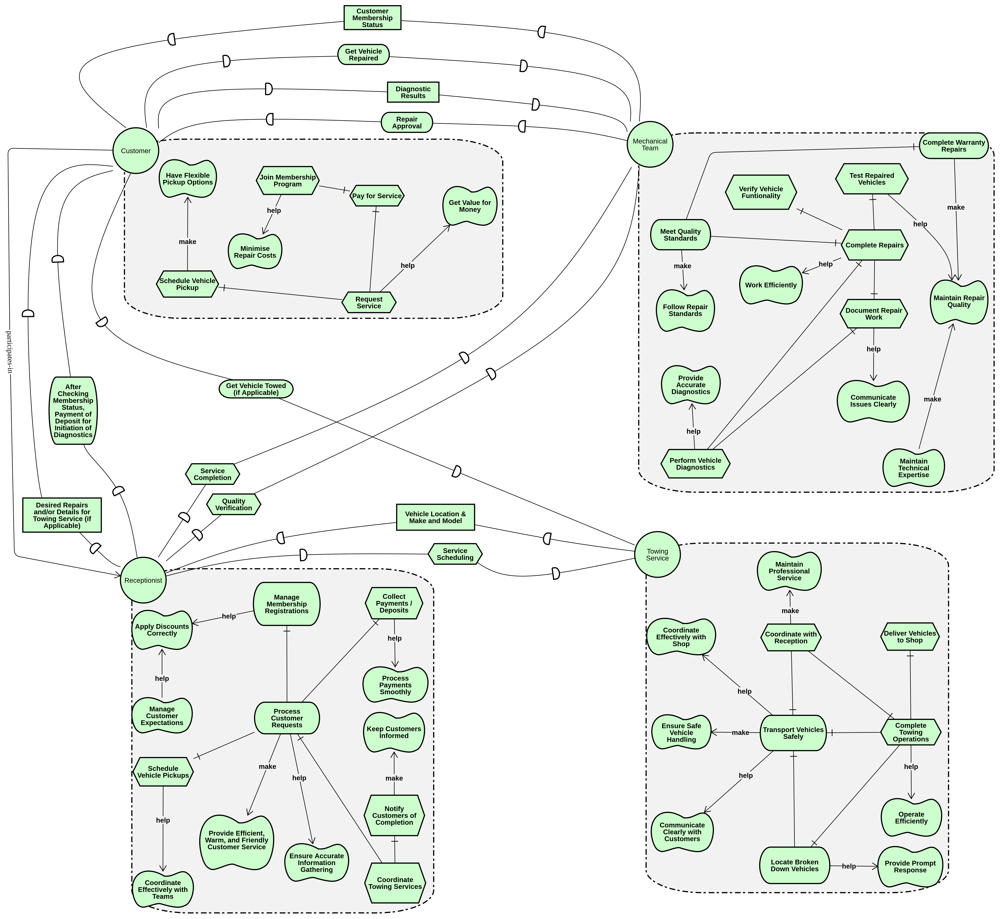
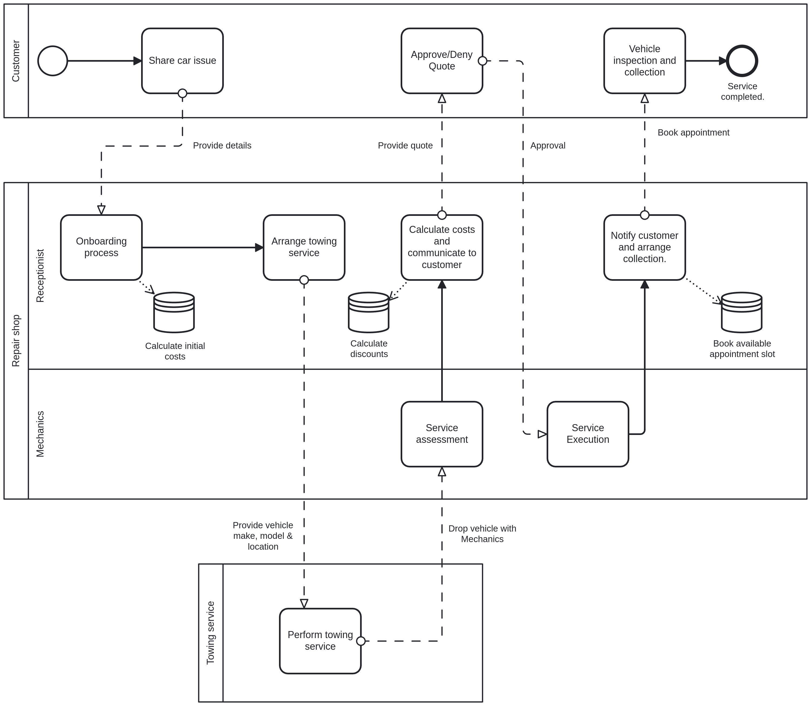
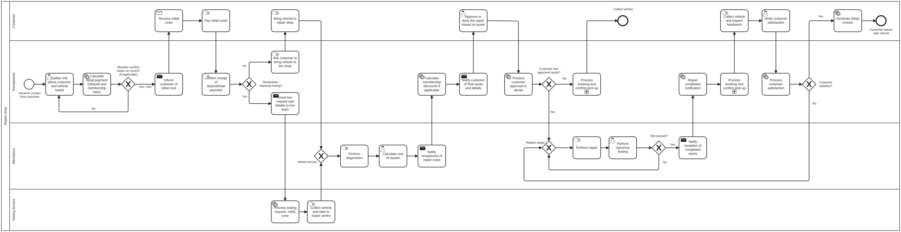

# Car Repair Shop Automation System Development of Information Systems Project

## Quick Start

### Build and Run

```bash
mvn clean package
java -jar target/RepairShop-1.0.0-SNAPSHOT.jar
```

## System Overview

### Goal-Oriented Requirements Engineering



### Strategic Business Process Model



### Operational Business Process Model



## Documentation

### 📄 Project Essays

1. **[Goal-Oriented Requirements Engineering (GORE)](essays/1_i-star-gore/GORE.pdf)**
   i\* framework analysis and requirements modeling

2. **[Strategic Business Process Model](essays/2_strategic-bpmn/strategic.pdf)**
   High-level BPMN strategic process design

3. **[Operational Business Process Model](essays/3_operational-bpmn/operational.pdf)**
   Detailed BPMN operational workflow implementation

4. **[Testing Methodology & Verification](essays/4_testing/testing.pdf)**
   System testing strategies and validation approach
   [Appendix A: Test Documentation](essays/4_testing/AppendixA.pdf)

## Project Structure

* **Java Application**: Camunda-based workflow automation for car repair services
* **BPMN Models**: Strategic and operational process definitions
* **JSON Forms**: User interaction forms for process tasks
* **Services**: Calendly, Stripe, and Membership management integration
